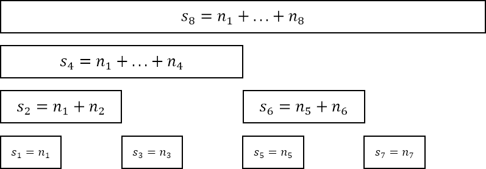
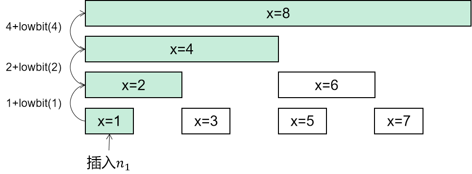
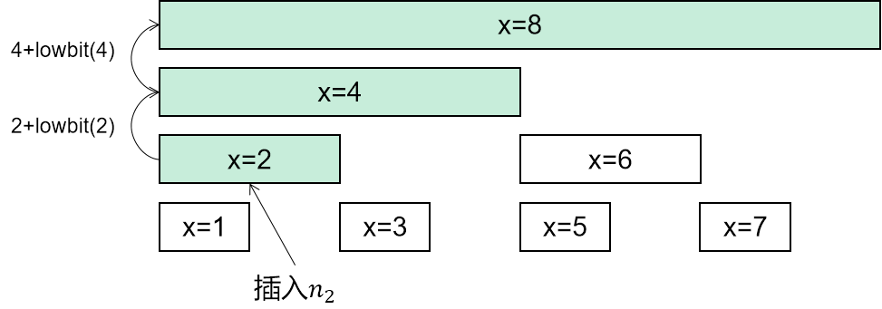
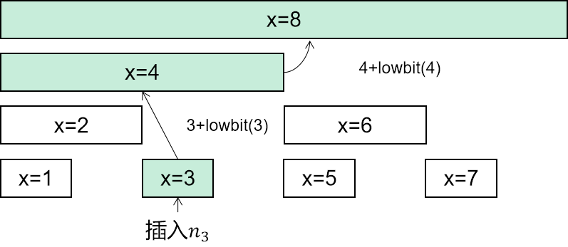

# 307. 区域和检索 - 数组可修改

- [🔗题目链接](https://leetcode-cn.com/problems/range-sum-query-mutable/)

## 暴力

```kotlin
/**
 * @author Yananart
 */
class NumArray(val nums: IntArray) {

    fun update(index: Int, `val`: Int) {
        nums[index] = `val`
    }

    fun sumRange(left: Int, right: Int): Int {
        var res = 0
        for (i in left..right) {
            res += nums[i]
        }
        return res
    }
}
```

## 树状数组

参考该[题解](https://leetcode-cn.com/problems/range-sum-query-mutable/solution/-by-hu-ge-8-t4rn/)

通过`lowbit`操作可以将一个数组划为一个个区间。

`lowbit(int x)=x & -x`

| x         | 1   | 2   | 3   | 4   | 5   | 6   | 7   | 8   | 9   |
|-----------|-----|-----|-----|-----|-----|-----|-----|-----|-----|
| lowbit(x) | 1   | 2   | 1   | 4   | 1   | 2   | 1   | 8   | 1   |

其主要功能是: 找到x的二进制数的最后一个1所表示的二进制。

题目中的查区间和需求，我们可以通过前缀和处理，而计算前缀和可以通过树状数组划分的一个个区间相加获得。

我们设树状数组`s[i]`。



我们接下来要做的就是，在更新某个数字时可以将其影响到树状数组中的节点都找出来进行更新。

更新某个节点x，判断其影响的下个节点，通过`x+lowbit(x)`寻找。







寻找某个区间x的前一段区间，通过`x-lowbit(x)`寻找。


以上可以完成设计。

```kotlin
/**
 * @author Yananart
 */
class NumArray(nums: IntArray) {
    // 累加和
    var sums: IntArray

    // 更新后数组
    var nums: IntArray

    init {
        // 原数组长度+1, +1的原因是计算lowbit时,使用下标0会进入死循环
        sums = IntArray(nums.size + 1)
        this.nums = nums
        for (i in nums.indices) {
            // 初始化累加和数组
            insert(i, nums[i])
        }
    }

    /**
     * 插入数字,初始化
     */
    private fun insert(index: Int, `val`: Int) {
        // 下标+1
        var x = index + 1
        while (x < sums.size) {
            sums[x] = sums[x] + `val`
            x += lowBit(x)
        }
    }

    /**
     * 计算lowBit
     */
    private fun lowBit(x: Int): Int {
        return x and -x
    }

    /**
     * 查询树状数组
     */
    private fun query(x: Int): Int {
        var i = x
        var s = 0
        while (i != 0) {
            s += sums[i]
            i -= lowBit(i)
        }
        return s
    }

    /**
     * 更新数组以及累加和
     */
    fun update(index: Int, `val`: Int) {
        var x = index + 1
        while (x < sums.size) {
            // 减去之前nums[index]的值, 加上新的值
            sums[x] = sums[x] - nums[index] + `val`
            x += lowBit(x)
        }
        nums[index] = `val`
    }

    fun sumRange(left: Int, right: Int): Int {
        return query(right + 1) - query(left)
    }
}
```
